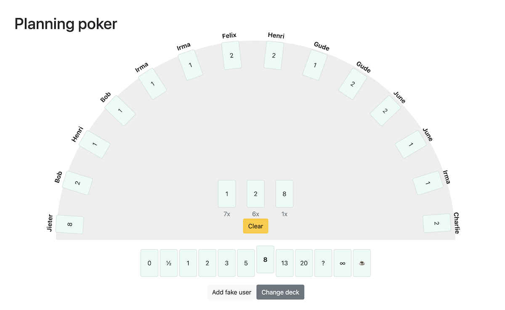

# Planning poker based on django-channels

 - No user management, just type a name and share the url.
 - 2 decks: T-shirt sizes & modified fibonacci.
 - No special admin roles: every participant can reveal, clear and change the deck.

# Local development
1. Create a virtual environment
1. Install the requirements: `pip install -r requirements.txt`
1. Apply the migrations: `./manage.py migrate`
1. Start a Redis server for backing storage: `docker run -p 6379:6379 -d redis:5`
1. Compile the JavaScript files: `npm run dev`
1. Run the server: `./manage.py runserver`
1. Navigate to http://localhost:8004/ to start a new session

# Running on regular ubuntu 22.04
1. `sudo apt install redis-server python3.11-venv supervisor`
1. `python3.11 -m venv virtualenv`
1. `source virtualenv/bin/activate`
1. `git clone https://github.com/jieter/planning-poker.git`
1. Run `deploy/deploy.sh`

Then use
- `deploy/supervisor.conf` as a template with `supervisor` to run `daphne`, taking care to add correct environment for
  - `SECRET_KEY`
  - `HOSTNAME`
  - `PRODUCTION=1`
- `deploy/nginx-site.conf` as a template with `nginx` to act as a reverse proxy.
