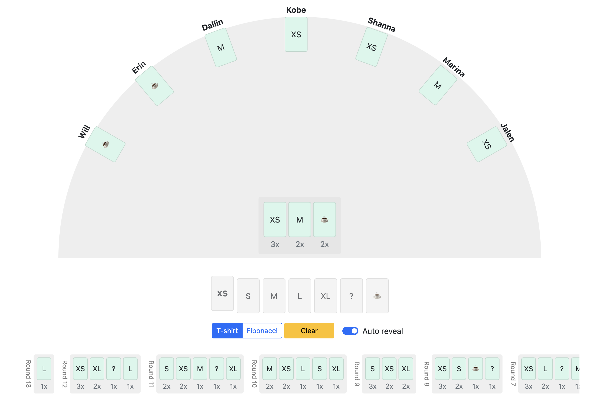

# Planning poker based on django-channels

 - No user management, just type a name and share the url.
 - 2 decks: T-shirt sizes & modified fibonacci.
 - No special admin roles: every participant can reveal, clear and change the deck.

# Local development

1. Create a virtual envirionment
1. Install the requirements: `pip install -r requirements.txt`
1. Apply the migrations: `./manage.py migrate`
1. Start a Redis server for backing storage: `docker run -p 6379:6379 -d redis:5`
1. Compile the JavaScript files: `npm run dev`
1. Run the server: `./manage.py runserver`
1. Navigate to http://localhost:8004/ to start a new session

# Running on render.com (free tier)

1. Configure a database, wait until it is ready and use "External Database URL"
1. Configure a redis instance, use the hostname part of "Internal Redis URL"
1. Create a web service from this repository
    - Build command: `./build.sh`
    - Start command: `daphne -b 0.0.0.0 app.asgi:application`
    - Environment variable: `PRODUCTION` `True`
    - Environment variable: `SECRET_KEY` to a secret value
    - Environment variable: `PYTHON_VERSION` `3.11.2`
    - Environment variable: `DATABASE_URL` (value from "External Database URL")
    - Environment variable: `REDIS_HOST` (hostname part from "Internal Redis URL")

# Running on regular ubuntu 22.04
1. `sudo apt install redis-server python3.11-venv supervisor`
1. `python3.11 -m venv virtualenv`
1. `source virtualenv/bin/activate`
1. `git clone https://github.com/jieter/planning-poker.git`
1. `cd planning-poker`
1. `pip install -r requirements.txt`
1. `./manage.py migrate`
1. `./manage.py collectstatic --no-input`

Then use
- `deploy/supervisor.conf` as a template with `supervisor` to run `daphne`, taking care to add correct environment for
  - `SECRET_KEY`
  - `HOSTNAME`
  - `PRODUCTION=1`
- `deploy/nginx-site.conf` as a template with `nginx` to act as a reverse proxy.
